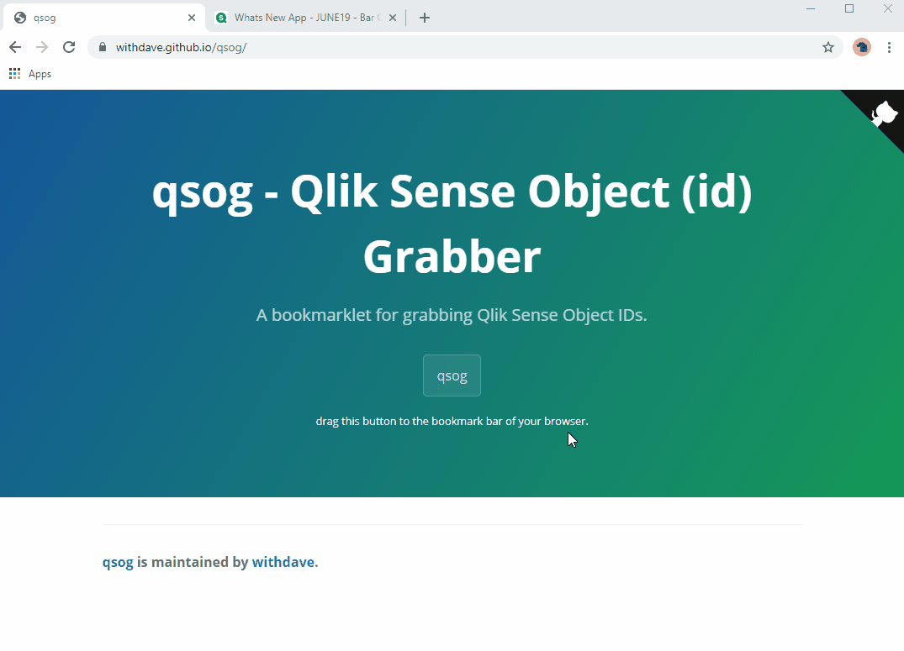

# qsog

Qlik Sense Object Grabber (Bookmarklet to get Qlik Sense object IDs).

Create a bookmark using the self-contained bookmarklet from https://withdave.github.io/qlik-sense-object-id-grabber/.

*Demo of bookmarklet in a Qlik Sense app*

## Purpose

This bookmarklet is designed to be saved into a bookmark on your browser bar, and is a quick and easy way of allowing easy extraction of Qlik Sense object IDs.

## Use

1. Navigate to https://withdave.github.io/qlik-sense-object-id-grabber/, and drag the qsog button to your bookmark bar (or create a bookmark using the code in `bookmarklet.txt`)
2. Navigate to a Qlik Sense sheet and click the bookmark. Each time you refresh or navigate away you will need to click the button again.
3. qsog will place a green box containing the object ID in the bottom right of each object, and also log this information to the console.
4. To copy the object ID, click on the text to copy it to the clipboard

## Local build
If you want to rebuild the bookmarklet after edits:

1. Install deps: `npm install`
2. Build: `npm run build`
3. Copy/paste the output from `bookmarklet.txt` into your bookmark.
